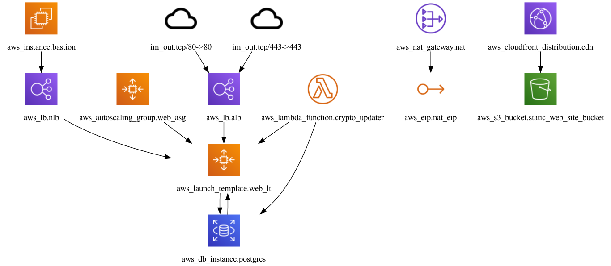

всё в ТФ:
1. завести EC2 инстанс на убунту 22, с кастомным ключом и пробросом порта 2000 в 22
2. завести клаудфронт со статичным вебсайтом, файлы в с3
3. завести тестовую базу с доступом только из внутренней сети IP/16 на постгрес и подключить к ней из №1

UPD: все параметры типа диск, ID ami, название ключа через variables

ec2
ecr
s3
data.iam (for s3 poicies)
rds
variables.tf
outputs.tf
kms
route53
securitygroups
*redis
*ecs

proj structure:
